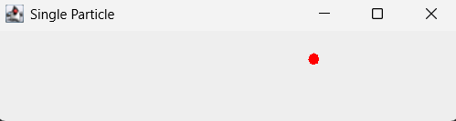

# Triangle Agent


[](https://opensource.org/licenses/MIT)

This is a tiny partical simulator i made as my first real project in java, it mainly serves me as a guide on how syntax, code structure and oop in general looks, feels and works like!

---

## Tech Stack

- Language: Java
- Main libs/frameworks: java.awt + javax.swing

---

## Features


- a Window opening (i am new have mercy with the judgment)
- a little partical flying across the screen
- bouncing off walls!


- i will defenetly tinker around with this more tho currently there is nothing specific on my mind

---

### Installation

1. Make sure you have Java JDK installed (Java 17+ recommended):
   https://www.oracle.com/java/technologies/downloads/

2. Clone this repository:
   ```bash
   git clone https://github.com/YOURNAME/triangle-agent.git
   cd triangle-agent

